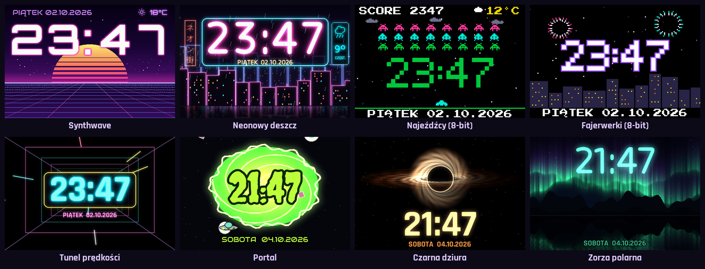
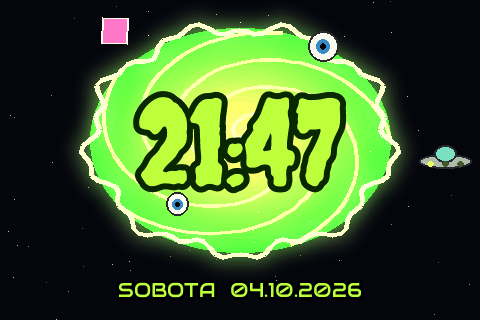
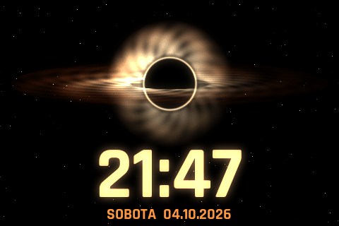
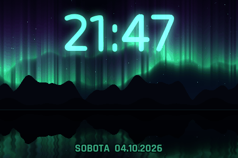
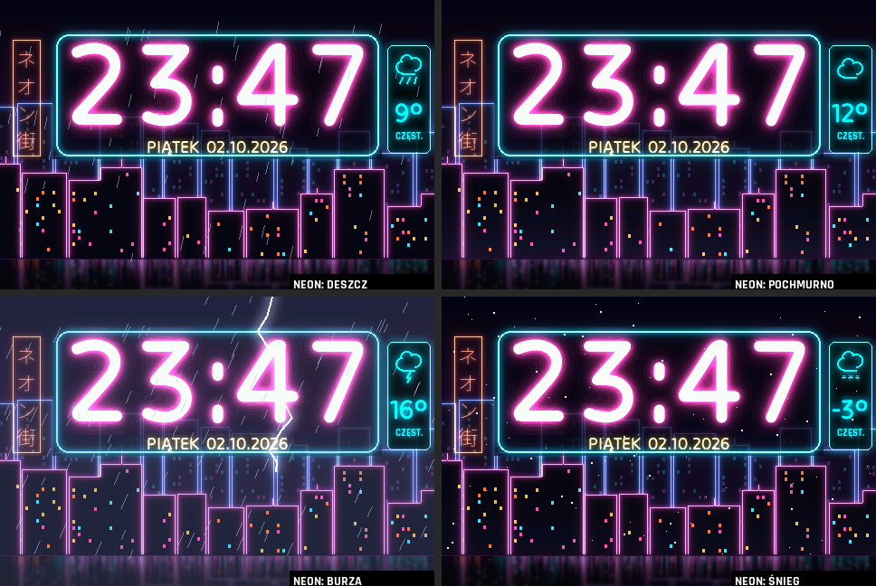
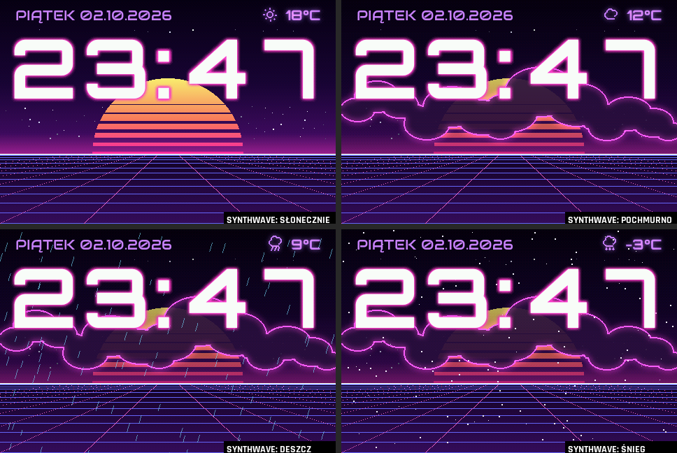
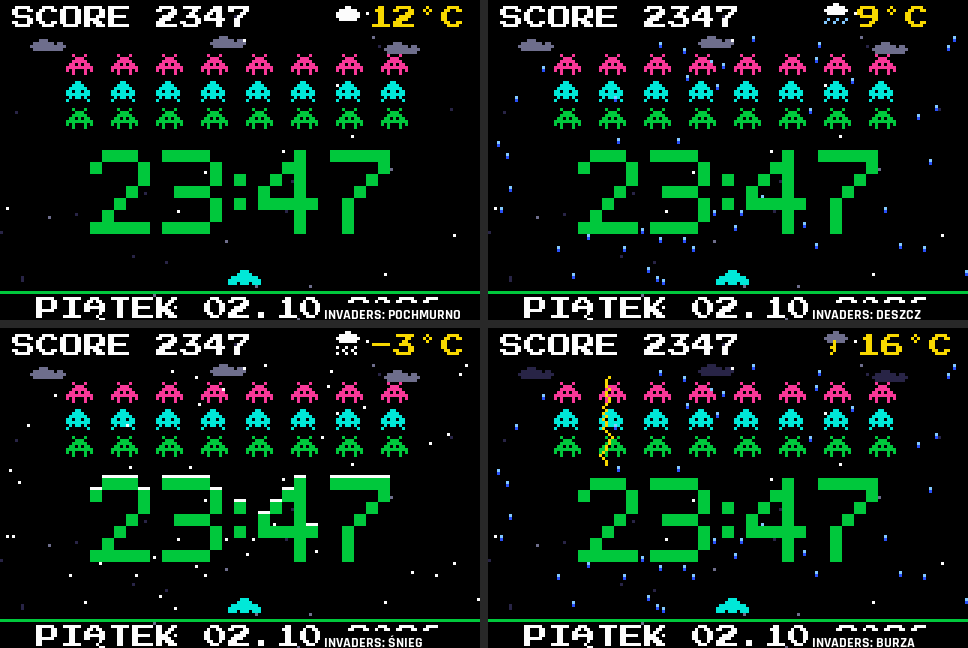
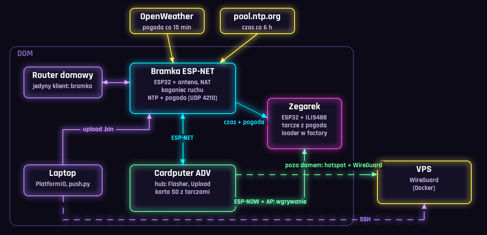

# ESP32 Synthwave Watch

Zegar na **ESP32 + 3,5" TFT ILI9488 (480×320)** z wymiennymi, animowanymi
tarczami: synthwave, neonowe miasto w deszczu, 8-bitowe gry, kosmos i zorza.
Tarcze znają **prawdziwą pogodę**, a nowe wersje wgrywa się **bez kabla**
z Cardputera ADV.




## Animacje

<p align="center">
  
  
  
</p>

Wszystko liczy się na żywo na ESP32, około 11 klatek na sekundę. Ekran jest
przerysowywany tylko tam, gdzie coś się zmienia (dirty rects), przez dwa
bufory DMA, więc składanie obrazu idzie równolegle z wysyłką po SPI.

## Tarcze

| Tarcza | Co się dzieje | Środowisko PlatformIO |
|---|---|---|
| **Synthwave** | Przewijana siatka perspektywiczna, słońce z przecięciami, migające gwiazdy, glitch VHS. | `synthwave` |
| **Neonowy deszcz** | Neonowy szyld z godziną nad miastem z obrysowanymi budynkami, migające okna, latające auto, falujące odbicia. Cyfry „zajękują się” jak stara świetlówka. | `neon_rain` |
| **Najeźdźcy (8-bit)** | Cyfry są osłonami, w które kosmici wybijają dziury. Statek sam celuje, czasem przelatuje UFO. O pełnej godzinie wybucha cała flota. | `invaders` |
| **Fajerwerki (8-bit)** | Rakiety nad pikselowym miastem. O pełnej godzinie jest wielki pokaz. | `fireworks` |
| **Tunel prędkości** | Neonowy tunel pędzący na widza i smugi światła. Przy zmianie minuty tunel na chwilę mocno przyspiesza. | `tunnel` |
| **Portal** | Wirujący zielony portal z falującą krawędzią, wylatujące kostki i gałki oczne, krążący spodek. | `portal` |
| **Czarna dziura** | Dysk akrecyjny z rotacją różnicową (wewnętrzne pierścienie szybciej), efektem Dopplera i zakrzywionym światłem nad cieniem. | `blackhole` |
| **Zorza polarna** | Kurtyny zorzy liczone na żywo, odbicie w jeziorze, meteory przy zmianie minuty. | `aurora` |

## Pogoda

Trzy tarcze reagują na prawdziwą pogodę z OpenWeather, a każda pokazuje ją
w swoim stylu:

- **Neonowy deszcz:** deszcz pada tylko wtedy, gdy naprawdę pada, i z
  prawdziwą siłą. Do tego śnieg, mgła przy ulicy gdy sucho, a przy burzy
  błyskawice.
- **Synthwave:** neonowe chmury przesłaniają słońce, pada deszcz albo śnieg.
- **Najeźdźcy:** pikselowe chmury, krople, a przy śniegu biała czapa na
  osłonach.

<p align="center">
  
  
</p>
<p align="center">
  
</p>

Zegarek nie łączy się z internetem. Pogodę (i czas) pobiera osobna bramka
ESP-NET, a zegarki pytają ją lokalnie po UDP:

```
WX1 <wiek_s> <temp*10> <odczuwalna*10> <kod_owm> <chmury_%> <deszcz*10> <snieg*10> <wiatr*10> <dzien> <min*10> <max*10>
```

Do obejrzenia wszystkich wariantów bez czekania na pogodę służą środowiska
`*_wxdemo`, które co 20 s zmieniają pogodę: słońce, chmury, deszcz, ulewa,
burza, śnieg, mgła.

## Cały system



- **Bramka ESP-NET** (osobny ESP32 z anteną) jako jedyna rozmawia z routerem
  domowym. Ma limity nowych połączeń i pakietów („kaganiec”), żeby projekty
  nie zapychały routera, i sama podaje czas i pogodę wszystkim urządzeniom.
- **Cardputer ADV** z własnym hubem wgrywa tarcze bezprzewodowo. Przez ESP-NOW
  wysyła podpisany (HMAC) rozkaz, zegarek restartuje się do loadera w
  partycji `factory` i odbiera nowy obraz przez AP Cardputera.
- **Laptop** wysyła gotowe `.bin` na kartę SD Cardputera przez bramkę, a
  poza domem przez tunel WireGuard na VPS-ie.

## Sprzęt

- ESP32-WROOM-32 (klon; flash zawsze w trybie **DIO 40 MHz**, bo QIO
  bootloopuje)
- Wyświetlacz TFT 3,5" **ILI9488** SPI 320×480

| Sygnał | GPIO |
|---|---|
| CS | 15 |
| DC | 2 |
| RST | 4 |
| MOSI | 23 |
| SCLK | 18 |
| MISO | 19 |
| BL (podświetlenie) | 32 |

## Budowanie

```bash
pio run -e synthwave          # dowolna tarcza z tabeli
pio run -e neon_rain_wxdemo   # wersja demo pogody
pio run -e bench              # benchmark wyświetlacza i ESP32
```

Każda tarcza to osobny obraz w `dist/<nazwa>_<wersja>.bin`, z nazwą i
wersją zapisanymi w `esp_app_desc_t`, które Flasher pokazuje na liście.

Partycje (4 MB):

| Partycja | Adres | Rozmiar | Zawartość |
|---|---|---|---|
| `factory` | `0x10000` | 1 MB | loader (odbiera nowe obrazy bezprzewodowo) |
| `ota_0` | `0x110000` | 2,9 MB | tarcza zegarka |

Wymagany jest plik `include/secrets.h` (wzór w `secrets.h.example`) z danymi
sieci ESP-NET i kluczem linku.

## Struktura

```
src/core/            wspólny szkielet: ekran, bufory DMA, Wi-Fi/NTP/pogoda, ESP-NOW
src/faces/<tarcza>/  każda tarcza osobno (face::begin / drawAll / frame)
src/faces/common_hd  glify neon/obrys, kafelki brudnych prostokątów
src/faces/common_8bit silnik 8-bit 160×107 ×3 z paletą NES
lib/wroom_link/      protokół ESP-NOW wspólny z Cardputerem
tools/prerender/     generatory zasobów (Python): czcionki, mapy, LUT-y, makiety
docs/img/            rendery do README
```

Zasoby (cyfry z poświatą, mapy pikseli czarnej dziury i portalu, tła)
generują skrypty w Pythonie w `tools/prerender/` i trafiają do flasha jako
tablice C. Rendery w README pochodzą z tych samych generatorów. Dla części
tarcz to ta sama matematyka co na ESP32, dla pozostałych to makiety
projektowe.

## Wydajność

ILI9488 przez SPI przyjmuje tylko kolor 18-bitowy (3 bajty na piksel), więc
pełny ekran przy 26,7 MHz to około 136 ms. Dlatego tarcze przerysowują
tylko zmieniane fragmenty. Środowisko `bench` mierzy zegary SPI 26,7, 40 i
80 MHz (z weryfikacją odczytem z ekranu), wysyłkę bez konwersji kolorów,
przeplot, przepustowość flash/RAM i koszt piksela na jednym i dwóch rdzeniach.

## Czcionki

Czcionki w `tools/prerender/fonts/` pochodzą z Google Fonts (SIL Open Font
License / Apache 2.0) oraz DSEG (OFL): Orbitron, Audiowide, Rajdhani, Tilt
Neon, Press Start 2P, Creepster, Oxanium i inne.

## Licencja

MIT — rób z tym co chcesz.
